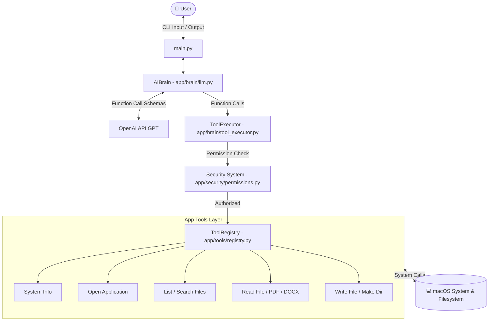

# 🤖 NEXUS — Personal AI Assistant

<p align="center">
  
  
  
  
  
</p>

---

## 🌟 Overview

**NEXUS** is an autonomous, intelligent personal assistant built specifically for **macOS**. Powered by **OpenAI's LLM Function Calling**, NEXUS bridges the gap between natural language interaction and system-level automation. It safely inspects hardware resources, launches applications, searches and manages local files, and extracts document insights—all through a secure, permission-controlled tool execution architecture.

---

## ✨ Key Features

### 🧠 Intelligent Reasoning Engine
- **Dynamic Tool Calling**: Uses structured function definitions to query real-time system stats and manipulate files safely.
- **Context-Aware Dialogue**: Maintains conversation history for multi-step reasoning.
- **Zero Hallucination Policy**: Refuses to fabricate system data or claim unverified execution.

### 🛡️ Tiered Security & Confirmation Framework
- **Multi-Level Permissions**: Classifies system actions into `SAFE`, `MODERATE`, `DANGEROUS`, and `CRITICAL`.
- **Confirmation Prompts**: Requires explicit user consent before executing destructive or high-risk commands.
- **Restricted Directory Sandbox**: Enforces file operations within user-approved locations (`Desktop`, `Documents`, `Downloads`).

### 💻 Native macOS Integration
- **System Monitoring**: Queries CPU load, RAM memory usage, storage capacity, and OS release info.
- **App Launcher**: Opens installed macOS applications directly from chat.

### 📄 Advanced File & Document Automation
- **Multi-Format Document Parsing**: Reads and extracts clean text from `.pdf`, `.docx`, `.txt`, `.md`, `.json`, `.csv`, and `.py` files.
- **Smart Search & Management**: Recursively searches directories using pattern matching (`*.pdf`, `resume*`), creates folders, and writes files.

---

## 🏗️ Architecture



---

## 📂 Project Structure

```text
JARVIS/
├── app/
│   ├── brain/
│   │   ├── __init__.py
│   │   ├── llm.py               # Core AIBrain & OpenAI Function Definitions
│   │   └── tool_executor.py     # Dispatches tool calls with safety checks
│   ├── config/
│   │   ├── __init__.py
│   │   └── settings.py          # Environment configuration & model settings
│   ├── security/
│   │   ├── confirmations.py     # Interactive CLI prompt handlers
│   │   └── permissions.py       # Permission levels (SAFE, MODERATE, DANGEROUS, CRITICAL)
│   └── tools/
│       ├── __init__.py
│       ├── applications.py      # macOS app opening logic
│       ├── document_reader.py   # PDF & DOCX text extraction
│       ├── file_reader.py       # Plaintext/code file reader
│       ├── file_writer.py       # Directory & file creation
│       ├── filesystem.py        # Directory listing & wildcard file search
│       ├── manager.py           # Tool registry builder
│       ├── registry.py          # Tool registration & lookup engine
│       └── system.py            # Platform stats (CPU, RAM, Disk, OS)
├── data/
│   └── logs/                    # System operation logs
├── tests/
│   ├── test_applications.py     # App opener unit tests
│   ├── test_filesystem.py       # Filesystem & directory tests
│   ├── test_registry.py         # Tool registry unit tests
│   └── test_system.py           # System info unit tests
├── .env                         # API Keys & Local Secrets (Ignored)
├── .gitignore                   # Excludes .venv, __pycache__, logs, .env
├── main.py                      # Interactive CLI Entry Point
├── requirements.txt             # Python Package Dependencies
└── README.md                    # Project Documentation
```

---

## 🛠️ Tool Capabilities

| Tool Name | Permission Level | Description |
| :--- | :---: | :--- |
| `system_info` | 🟢 **SAFE** | Real-time macOS telemetry (CPU, RAM, disk, OS). |
| `open_application` | 🟢 **SAFE** | Launches any installed macOS application. |
| `list_directory` | 🟢 **SAFE** | Lists contents of allowed directories (`Desktop`, `Documents`, `Downloads`). |
| `search_files` | 🟢 **SAFE** | Recursive search supporting wildcard patterns (`*.pdf`, `test_*`). |
| `read_file` | 🟢 **SAFE** | Reads text-based files (`.txt`, `.md`, `.json`, `.csv`, `.py`). |
| `read_pdf` | 🟢 **SAFE** | Parses and extracts structured text from PDF documents. |
| `read_docx` | 🟢 **SAFE** | Parses text and paragraphs from Microsoft Word documents. |
| `create_directory` | 🟡 **MODERATE** | Creates new directory paths inside allowed locations. |
| `write_file` | 🟡 **MODERATE** | Creates or updates text files safely. |
| `delete_file` | 🔴 **DANGEROUS** | Deletes files with mandatory confirmation prompt. |
| `terminal_execute` | 🔴 **DANGEROUS** | Executes terminal commands with user verification. |

---

## 🚀 Quick Start

### 1. Prerequisites
- **macOS** (Apple Silicon or Intel)
- **Python 3.12+**
- **OpenAI API Key**

### 2. Installation

Clone the repository and navigate into the project directory:
```bash
git clone https://github.com/LikhithRao15/personal-ai-assistant.git
cd personal-ai-assistant
```

Create and activate a Python virtual environment:
```bash
python3 -m venv .venv
source .venv/bin/activate
```

Install dependencies:
```bash
pip install -r requirements.txt
```

### 3. Environment Configuration

Create a `.env` file in the root directory:
```bash
cp .env.example .env 2>/dev/null || touch .env
```

Add your OpenAI API credentials to `.env`:
```env
OPENAI_API_KEY=your_actual_openai_api_key_here
MODEL_NAME=gpt-5
```

### 4. Running NEXUS

Launch the assistant:
```bash
python main.py
```

**Example Conversation:**
```text
============================================================
NEXUS — Personal AI Assistant
============================================================
Type 'exit' to quit.

You: What is my Mac's current CPU and RAM usage?

NEXUS: Here is your current system status:
- Operating System: macOS 15.2 (arm64)
- CPU Usage: 12.4%
- RAM Usage: 58.2% (9.3 GB / 16.0 GB used)
- Disk Usage: 42.1% free

You: Search for all PDF documents on my Desktop.

NEXUS: Found 3 PDF documents in ~/Desktop:
1. Q3_Report.pdf
2. Resume_2026.pdf
3. Architecture_Diagram.pdf
```

---

## 🧪 Testing

Run the automated test suite using `pytest`:
```bash
pytest tests/ -v
```

---

## 🛣️ Roadmap

- [x] OpenAI LLM Brain with Function Calling
- [x] Tiered Permission & Security System
- [x] macOS System Telemetry & App Launcher
- [x] Multi-format Document Extraction (PDF, DOCX, TXT, Code)
- [ ] 🗣️ Voice Input / Output (Speech-to-Text & Text-to-Speech)
- [ ] 🌐 Browser Automation Subagent
- [ ] 🖥️ Native macOS Status Bar Overlay

---

## 📜 License

Distributed under the **MIT License**. See `LICENSE` for details.

---

<p align="center">
  Built with ❤️ for macOS power users.
</p>
